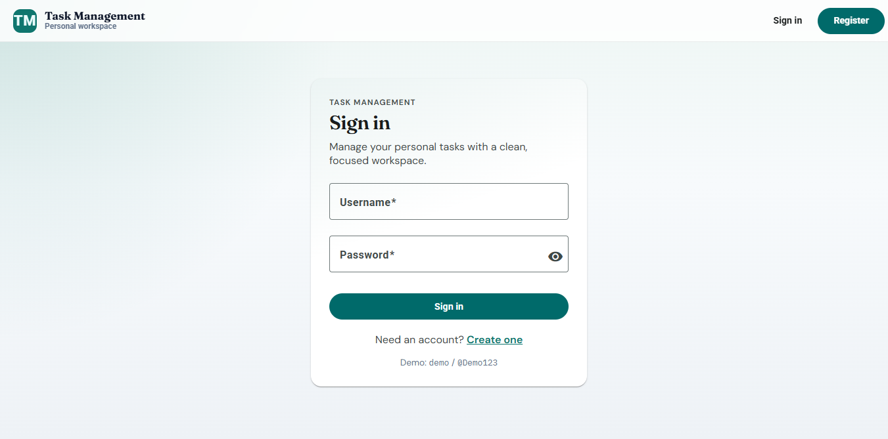
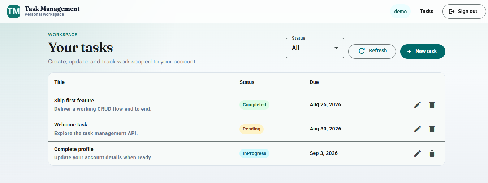
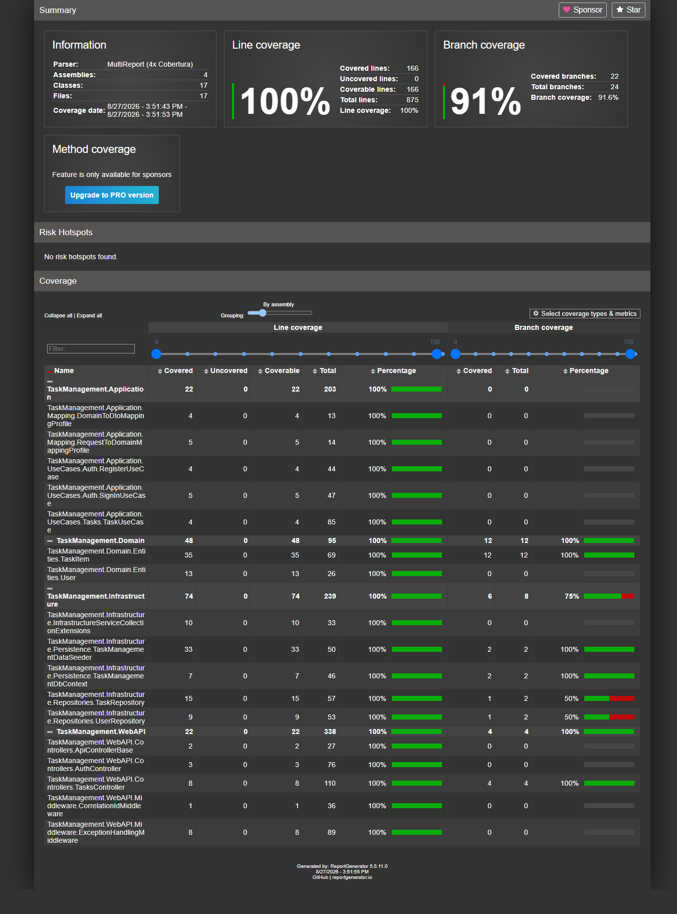
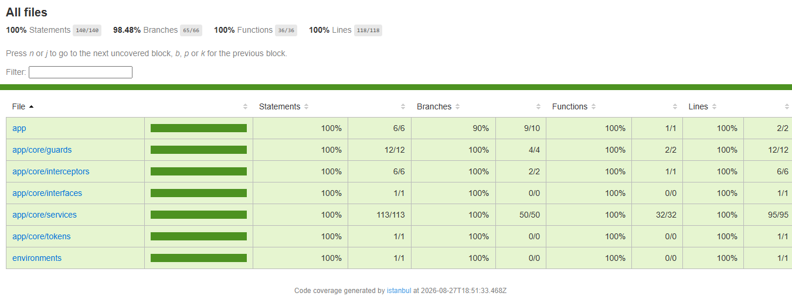

# Task Management Application

Full-stack personal task manager in a **single monorepo**: ASP.NET Core Clean Architecture API + Angular SPA, orchestrated by root npm scripts.

## Screenshots

### Sign in



### Tasks



### API coverage



### Web coverage



## Tech Stack

| Area | Technologies |
|------|----------------|
| Backend | ASP.NET Core (.NET 10), Clean Architecture, FluentValidation, AutoMapper, JWT auth, BCrypt, Serilog, Scalar OpenAPI |
| Frontend | Angular 22, Angular Material, RxJS, TypeScript |
| Data | Entity Framework Core, SQLite |
| Testing | xUnit / Coverlet / ReportGenerator (API), Vitest (Web) |
| Tooling | Node.js / npm (monorepo orchestrator) |

## Prerequisites

- Node.js **22.22+** (or Node 24 / 26) and npm — required by Angular 22
- .NET SDK **10** (see `global.json`)

## Quick start

```bash
npm run install:all
npm start
```

- API: **http://localhost:5000** (Scalar: **http://localhost:5000/scalar/**)
- Angular: **http://localhost:4200**

### Demo credentials

| Field | Value |
|--------|--------|
| Username | `demo` |
| Password | `@Demo123` |

## API overview

| Method | Route | Auth |
|--------|-------|------|
| POST | `/api/v1/auth/register` | Anonymous |
| POST | `/api/v1/auth/sign-in` | Anonymous |
| GET | `/api/v1/tasks` | JWT |
| GET | `/api/v1/tasks/{id}` | JWT |
| POST | `/api/v1/tasks` | JWT |
| PUT | `/api/v1/tasks/{id}` | JWT |
| DELETE | `/api/v1/tasks/{id}` | JWT |

Task status values: `Pending`, `InProgress`, `Completed`.

## Architecture

**Backend** — Clean Architecture:

| Layer | Project | Responsibility |
|-------|---------|----------------|
| Domain | `TaskManagement.Domain` | Entities + repository contracts |
| Application | `TaskManagement.Application` | Use cases, validation, mapping |
| Infrastructure | `TaskManagement.Infrastructure` | EF Core (SQLite), BCrypt, JWT, seeding |
| Web API | `TaskManagement.WebAPI` | Controllers, middleware, Scalar OpenAPI |

**Frontend** (`TaskManagement.WebUI`) — standalone Angular SPA with feature modules for auth and tasks, plus shared layout/UI. Users only access tasks scoped to their JWT user id.

## Frontend routes

- `/login`, `/register` (guest)
- `/tasks` — authenticated CRUD (default)

## Database

EF Core + SQLite. On API startup the app applies migrations and seeds the demo user (and sample tasks) if the database is empty.

- DB file: `src/TaskManagement.WebAPI/Database/TaskManagement.db`
- Manual migrate:

```bash
dotnet ef database update --project src/TaskManagement.Infrastructure --startup-project src/TaskManagement.WebAPI
```

## Tests & coverage

```bash
npm test
npm run coverage
npm run coverage:open
```

- API: Coverlet + ReportGenerator → `CoverageReport/index.html`
- Web: Vitest → `src/TaskManagement.WebUI/coverage/task-management/index.html`

## Useful scripts

| Script | Purpose |
|--------|---------|
| `npm start` | API + Scalar + Angular |
| `npm run start:api` | API + Scalar only |
| `npm run start:web` | Angular only (API must already be on :5000) |
| `npm run install:all` | Root + Angular dependencies |
| `npm test` | Backend + frontend unit tests (in parallel) |
| `npm run coverage` | Backend + frontend coverage (in parallel) |
